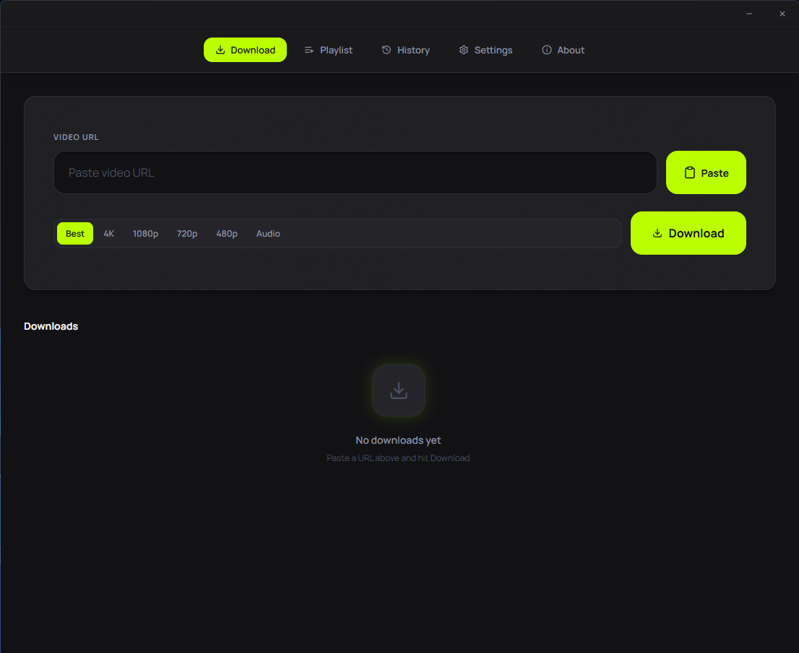
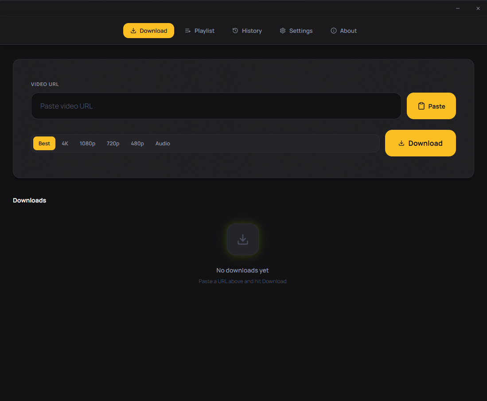
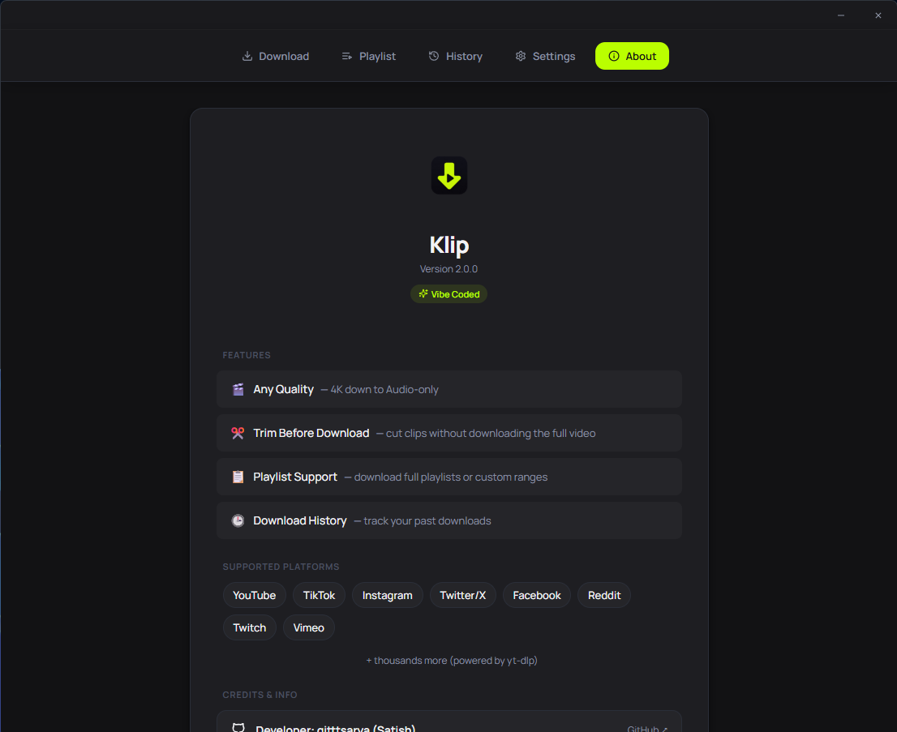
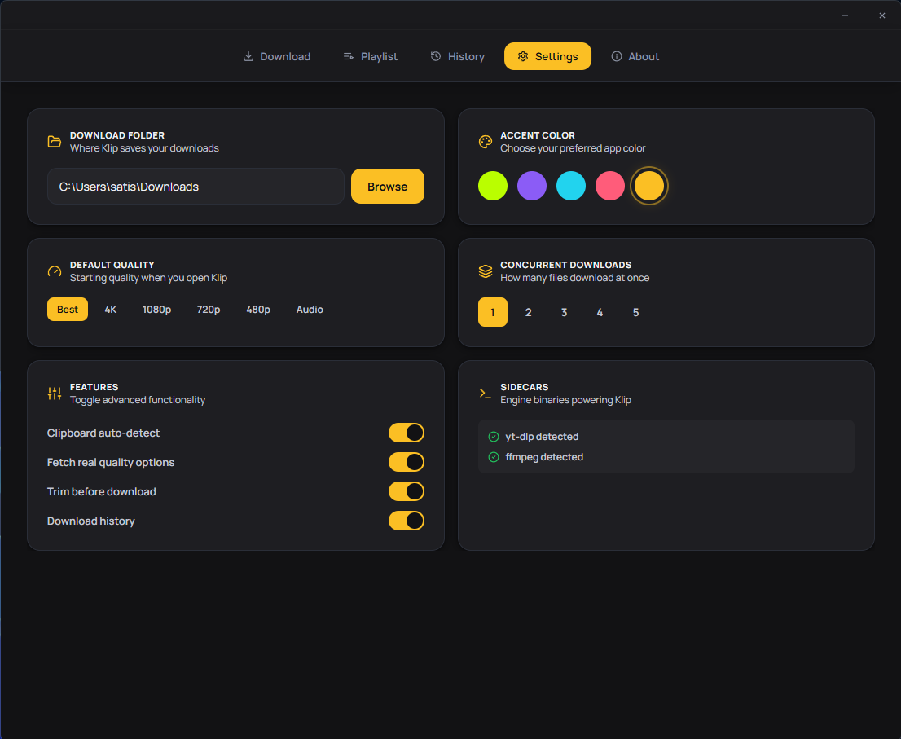
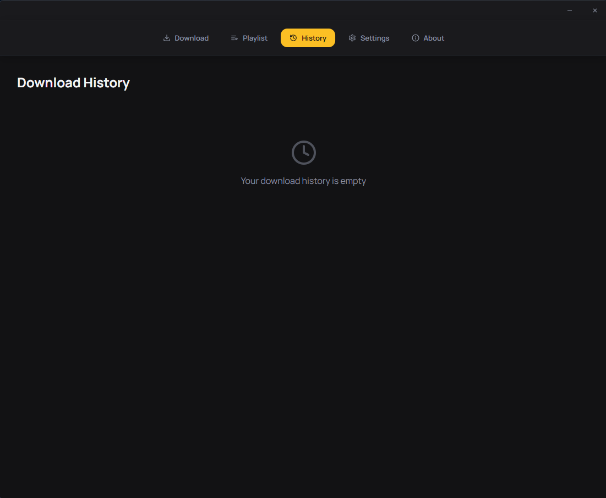

# Klip

A native desktop video downloader for Windows, built with Tauri and React. Download from YouTube, TikTok, Instagram, Twitter/X, Facebook, Reddit, Twitch, Vimeo, and thousands more sites via [yt-dlp](https://github.com/yt-dlp/yt-dlp).

[Download](https://github.com/gitttsarya/Klip/releases/latest) · [Report an issue](https://github.com/gitttsarya/Klip/issues)

## Screenshots

<table>
<tr>
<td></td>
<td></td>
</tr>
<tr>
<td></td>
<td></td>
</tr>
<tr>
<td colspan="2"></td>
</tr>
</table>

## Features

- Any quality — 4K down to audio-only
- Trim before downloading (grab just the clip you need)
- Playlist support, including custom ranges
- Download history
- Clipboard auto-detect
- Configurable concurrent downloads

## Supported platforms

YouTube, TikTok, Instagram, Twitter/X, Facebook, Reddit, Twitch, Vimeo, and more — anything yt-dlp supports.

## Installation

Download the installer from [Releases](https://github.com/gitttsarya/Klip/releases/latest) and run it. `ffmpeg` and `yt-dlp` are bundled, so there's nothing else to install.

## Tech stack

- [Tauri](https://tauri.app/) (Rust) for the app shell
- React + TypeScript for the UI
- yt-dlp + ffmpeg as bundled sidecar binaries

## License

MIT
